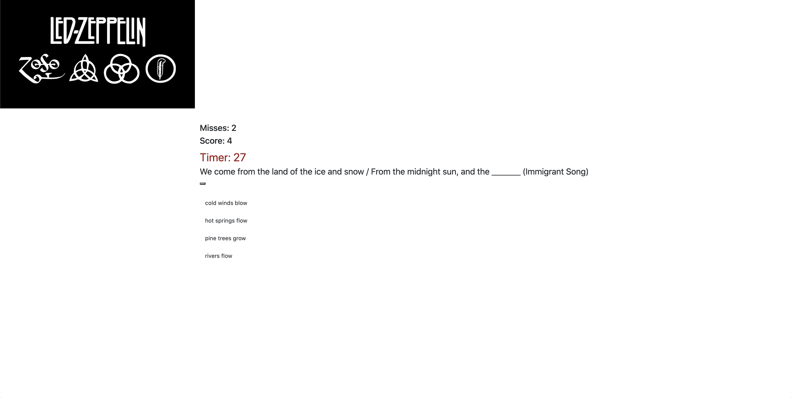

# Led Zeppelin Trivia Game
This time-based game uses JavaScript for the logic and jQuery to manipulate HTML. The player has a limited amount of time to answer each question. The game ends when the time runs out. The page will reveal the number of questions that players answer correctly and incorrectly.

https://psmith1.github.io/Trivia-Game/

## Technologies used
	•	JavaScript
	•	HTML/CSS
	•	jQuery

## Summary

